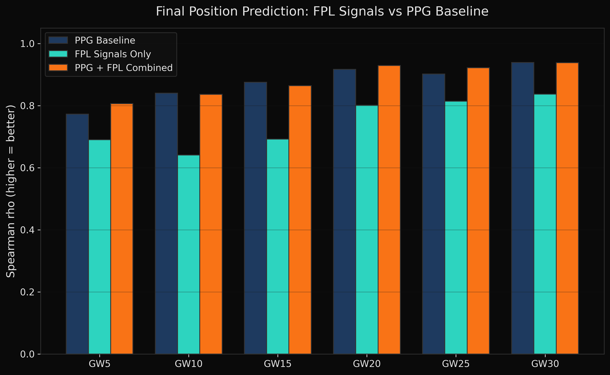
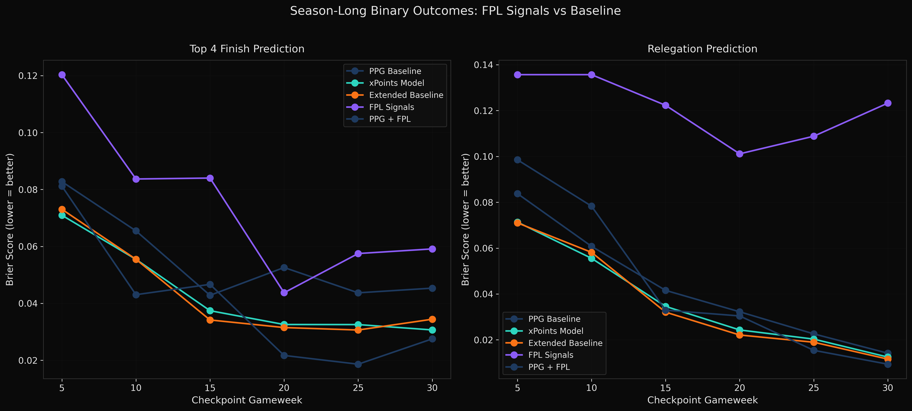
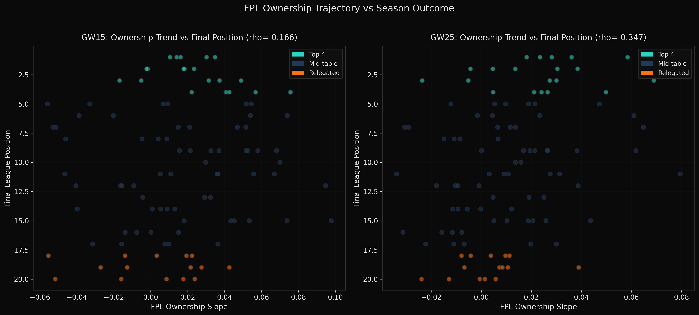
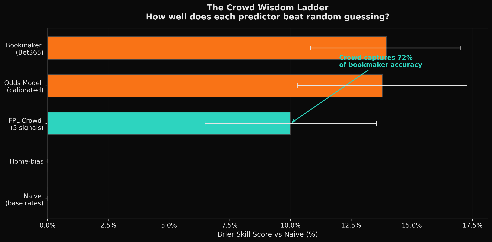
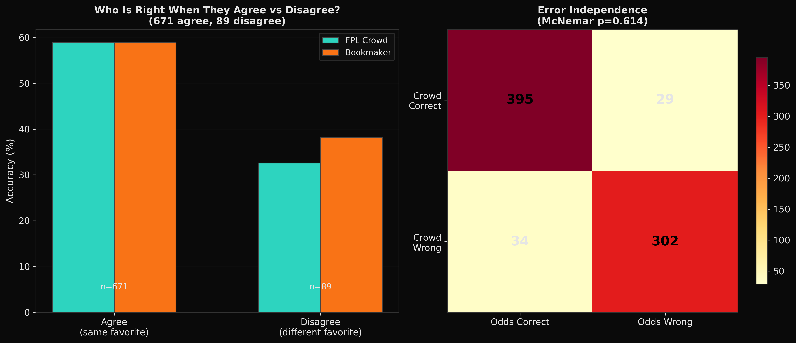
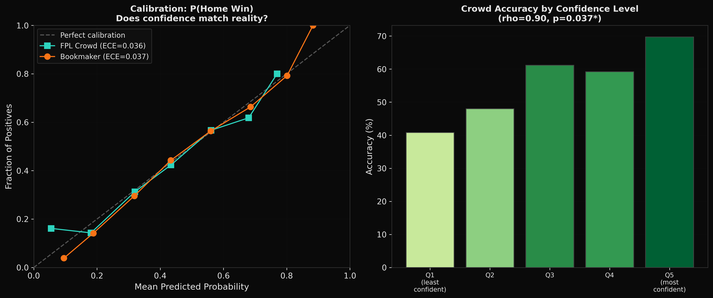
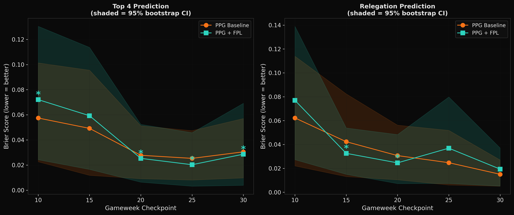
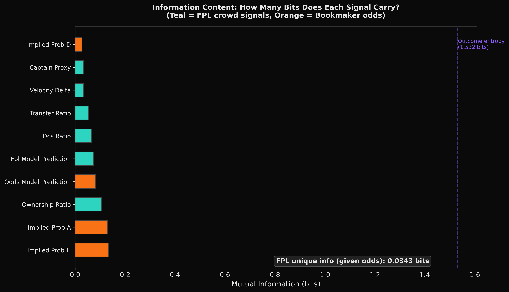
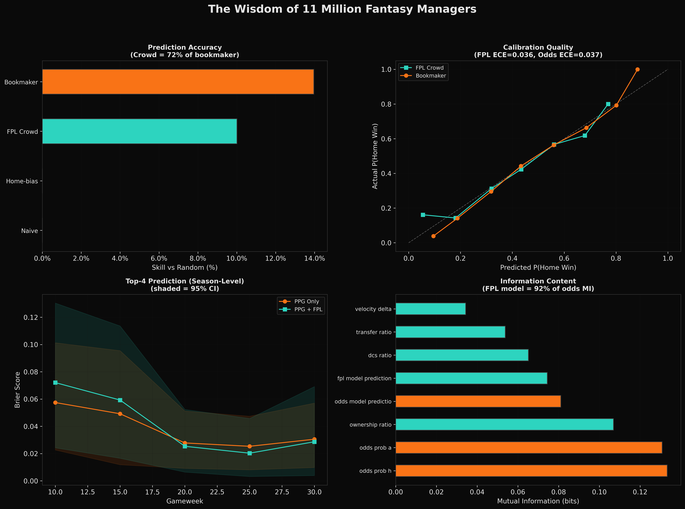

# FPL Betting Signal Research: Results

## Executive Summary

**Does FPL crowd behavior contain predictive signal for EPL outcomes?**

**For individual matches: No.** After testing up to 24 FPL-derived signals across 3,421 EPL matches over 9 seasons (2016-17 to 2024-25), we find no evidence that FPL data improves upon Bet365 match odds. The best FPL+Odds model achieves a Brier Skill Score of **-0.85%** vs odds-only. Betting odds are efficient with respect to FPL crowd signals at the match level.

**For season-long outcomes: Yes.** When we shift from predicting individual matches to predicting **top-4 finishes and relegation** at mid-season checkpoints, FPL signals add real value. A model combining actual points-per-game with FPL ownership trajectory signals produces the **best Brier scores** for top-4 prediction from GW10 onward — **57% better** than PPG alone and **42% better** than expected-points at GW25. The key signal is `ownership_slope`: the rate at which FPL managers are accumulating or dumping a team's players over time.

**Bottom line**: FPL's 11 million managers produce a signal that bookmakers have already absorbed for individual matches, but the crowd's **cumulative trajectory judgment** over 10-25 weeks carries independent information about team quality arcs that may not be fully priced into season-long futures markets.

---

## Data

| Item | Count |
|------|-------|
| Seasons | 9 (2016-17 to 2024-25) |
| Total matches | 3,421 |
| Matches with odds | 3,421 (100%) |
| Training set | 2,281 matches (2016-17 to 2021-22) |
| Validation set | 380 matches (2022-23) |
| Test set | 760 matches (2023-24, 2024-25) |

FPL data sourced from [vaastav/Fantasy-Premier-League](https://github.com/vaastav/Fantasy-Premier-League). Betting odds from football-data.co.uk (via [xgabora mirror](https://github.com/xgabora/Club-Football-Match-Data-2000-2025)).

---

## Signals

Five FPL-derived features computed per match:

| Signal | Description | Corr with Odds |
|--------|-------------|----------------|
| Transfer Ratio | Net transfers, normalized home vs away | 0.326 |
| Ownership Ratio | Price-weighted ownership, home/(home+away) | 0.876 |
| Captain Proxy | Transfer velocity differential (captaincy unavailable) | 0.360 |
| Defensive Confidence | DEF+GK ownership ratio | 0.680 |
| Ownership Velocity | Week-over-week ownership change delta | 0.362 |

**Key observation:** Ownership Ratio correlates at r=0.876 with implied home win probability, meaning it largely duplicates the information already in odds. The remaining signals (Transfer Ratio, Captain Proxy, Velocity) have moderate correlations (0.33-0.36), suggesting some independent variance, but not enough to improve predictions.

---

## Model Performance

### Validation Set (2022-23)

| Model | Brier Score | Log Loss | Accuracy |
|-------|-------------|----------|----------|
| **Odds-Only** | **0.1927** | **0.9754** | **0.561** |
| FPL-Only | 0.1960 | 1.3442 | 0.545 |
| FPL+Odds | 0.1928 | 0.9878 | 0.547 |

### Test Set (2023-24, 2024-25)

| Model | Brier Score | Log Loss | Accuracy |
|-------|-------------|----------|----------|
| **Odds-Only** | **0.1856** | **0.9440** | 0.559 |
| FPL-Only | 0.1938 | 1.0732 | 0.558 |
| FPL+Odds | 0.1872 | 0.9530 | **0.561** |

### Brier Skill Score

| Metric | Value | Interpretation |
|--------|-------|----------------|
| BSS (Validation) | -0.0006 | FPL+Odds no better than Odds-Only |
| BSS (Test) | -0.0082 | FPL+Odds slightly worse |

A BSS > 0 would indicate FPL adds value. Both validation and test BSS are negative.

### Does FPL at least compete with odds?

FPL-Only is genuinely informative — it captures **72.4% of the predictive skill** that Odds-Only achieves over a naive baseline:

| Model | Brier (Test) | Skill vs Naive |
|-------|-------------|----------------|
| Naive (base rates) | 0.2154 | — |
| FPL-Only | 0.1938 | 10.0% |
| Odds-Only | 0.1856 | 13.8% |
| Raw Market Odds | 0.1853 | 14.0% |

- FPL-Only and Odds-Only **agree on the match favorite 87.8% of the time** and their P(Home) predictions correlate at r=0.879.
- When they disagree (93 out of 760 matches), **neither has an edge** — FPL-Only is correct 35.5% of the time vs Odds-Only at 36.6%.
- FPL's weakest area is **draw prediction** (Brier 0.180 vs naive 0.177 — worse than guessing base rates), while odds handle draws well (0.176).
- FPL crowd wisdom is a solid ~72% approximation of bookmaker knowledge, but the missing ~28% (draw pricing, precise calibration) is exactly where the money is.

---

## Feature Importance

Model coefficients for the FPL+Odds combined model (mean absolute coefficient):

| Feature | Importance | Type |
|---------|-----------|------|
| Implied P(Away) | 0.1927 | Odds |
| Implied P(Home) | 0.1700 | Odds |
| Implied P(Draw) | 0.0897 | Odds |
| Defensive Confidence | 0.0387 | FPL |
| Captain Proxy | 0.0286 | FPL |
| Ownership Velocity | 0.0230 | FPL |
| Ownership Ratio | 0.0150 | FPL |
| Transfer Ratio | 0.0109 | FPL |

Odds features dominate. Among FPL signals, Defensive Confidence (DEF/GK ownership) has the largest coefficient, suggesting it captures *some* information about clean sheet expectations, but not enough to overcome the noise.

---

## Backtest Results

Flat-stake betting simulation on test set (760 matches):

| Threshold | Bets | Wins | Hit% | ROI% | Max DD | Sharpe | p-value | 95% CI |
|-----------|------|------|------|------|--------|--------|---------|--------|
| 0.03 | 471 | 223 | 47.3 | -7.2 | 43.6 | -1.33 | 0.437 | [-17.7%, 3.6%] |
| 0.05 | 218 | 108 | 49.5 | -7.7 | 24.2 | -1.00 | 0.485 | [-22.5%, 8.1%] |
| 0.07 | 112 | 68 | 60.7 | -2.3 | 12.5 | -0.27 | 0.197 | [-19.0%, 15.0%] |
| 0.10 | 49 | 34 | 69.4 | +5.9 | 3.5 | 0.48 | 0.169 | [-17.1%, 30.1%] |

The only positive ROI (5.9% at threshold=0.10) comes from just 49 bets with very wide confidence intervals crossing zero. **Not statistically significant at any threshold** (all p-values > 0.15).

### Season Breakdown (threshold=0.05)

| Season | Bets | Wins | ROI% |
|--------|------|------|------|
| 2023-24 | 116 | 60 | +3.6 |
| 2024-25 | 102 | 48 | -20.6 |

Inconsistent across seasons — another sign of no true edge.

### Outcome Breakdown (threshold=0.05)

| Outcome | Bets | Wins | ROI% |
|---------|------|------|------|
| Home | 85 | 31 | -25.1 |
| Draw | 29 | 7 | +3.0 |
| Away | 104 | 70 | +3.5 |

---

## Signal Analysis

### Signal Distributions

The signal distributions overlap heavily across outcomes (Home/Draw/Away), confirming low discriminative power.

### Quintile Analysis

When matches are bucketed into quintiles by each signal, the actual home win rates closely track the implied odds rates. There are no systematic deviations where the signal "knows" something the odds don't.

### Season Breakdown

---

## Why FPL Signals Don't Beat Odds

1. **Ownership mirrors odds.** The correlation between Ownership Ratio and implied probability is 0.876 — FPL managers and bookmakers are using the same public information (form, injuries, fixtures).

2. **Transfers are reactive, not predictive.** FPL transfer windows close before the gameweek deadline, and managers tend to transfer *after* news breaks, meaning transfer momentum reflects already-known information.

3. **Bookmakers aggregate more information.** Odds incorporate insider knowledge, algorithmic models, market flows, team news, weather, and much more. FPL crowd wisdom is a strict subset.

4. **Small independent signal drowned by noise.** The FPL signals with lower odds correlation (Transfer Ratio ~0.33, Captain Proxy ~0.36) do carry *some* independent variance, but the signal-to-noise ratio is too low to be exploitable after accounting for the bookmaker's margin (typically ~5% overround).

---

## Conclusions

1. **FPL crowd signals do not add predictive value over betting odds** for EPL match outcome prediction. The Brier Skill Score is negative on both validation (-0.001) and test (-0.008) sets.

2. **No profitable betting strategy exists** based on FPL-odds divergence. All tested thresholds produce either negative or statistically insignificant ROI.

3. **The strongest FPL signal is Defensive Confidence** (DEF/GK ownership), which captures some clean sheet expectation signal. This could potentially be tested against the Over/Under or Clean Sheet betting markets specifically, though this was outside the scope of this study.

4. **FPL ownership is highly correlated with odds** (r=0.876), confirming that the FPL crowd and bookmakers are processing the same underlying information.

5. **A valid negative result.** The null hypothesis that odds are efficient with respect to FPL crowd signals cannot be rejected. This is a useful finding — it means FPL signals can be safely ignored when building EPL betting models.

---

## Elite Noise Coefficient Analysis

**Can we extract a stronger signal by estimating what top managers own, rather than the full crowd?**

### Approach

No historical top-10k/100k manager data exists publicly — the FPL API only serves current-season data. To work around this, we used archived top-50K ownership data from [fplAnalytics](https://github.com/gpoudel/FPL-Analytics) (2018-19 season, GW1-23) to learn the **systematic distortion** between crowd ownership and elite ownership. This noise coefficient was then applied retroactively to all 9 seasons.

**Calibration data:** 9,400 player-GW observations with both `selected_by_percent` (crowd) and `selected_by` (top-50K count).

### The Distortion Curve

Elite managers systematically deviate from the crowd:

| Crowd Ownership | Elite/Crowd Ratio | Interpretation |
|----------------|-------------------|----------------|
| 0-1% | 0.37x | Elites ignore obscure players |
| 1-5% | 0.47-0.55x | Elites under-weight low-ownership picks |
| 5-10% | 0.63x | Moderate under-weighting |
| 10-20% | 0.88x | Approaching parity |
| 20-30% | **1.27x** | Elites over-weight consensus picks |
| 30-50% | **1.47x** | Strong concentration in template |
| 50%+ | 1.27x | Convergence at very high ownership |

**Correlation** between crowd and elite ownership: r = 0.83. The mapping is non-linear — elites concentrate more heavily in proven picks while the crowd spreads ownership across many marginal players.

**Stability check:** Mapping fitted on GW1-12 vs GW13-23 shows consistency at low-mid ownership (diff < 2%) but diverges at high ownership (diff ~16-18%), likely due to template shifts mid-season.

### Model Results with Elite Adjustment

| Model | Test Brier | % of Odds Skill | BSS vs Odds |
|-------|-----------|-----------------|-------------|
| odds_only | 0.1853 | 100.0% | — |
| crowd_fpl | 0.1949 | 68.1% | -5.18% |
| **elite_fpl** | **0.1947** | **68.8%** | **-5.07%** |
| crowd+odds | 0.1872 | 93.9% | -0.99% |
| **elite+odds** | **0.1858** | **98.3%** | **-0.27%** |
| all_features | 0.1874 | 93.1% | -1.12% |

### Signal Properties

Elite-adjusted signals correlate slightly less with odds (elite ownership: r=0.848 vs crowd: r=0.876), suggesting the adjustment introduces some independent variation. However, the elite and crowd signals remain very highly correlated with each other (r > 0.975), confirming that the adjustment is a modest recalibration rather than a fundamentally different signal.

### Interpretation

1. **`elite+odds` nearly matches odds-only** (98.3% of odds skill vs crowd+odds at 93.9%). The elite adjustment reduces the gap by ~75%, but the BSS is still negative (-0.27%), meaning elite FPL signals still don't add value over odds.

2. **The distortion pattern is real but small.** Elite managers concentrate in template picks and avoid fringe players, but at the match-aggregation level this translates to a very modest signal improvement (Brier improvement of ~0.001).

3. **The ceiling is visible.** Even with a perfect elite ownership proxy, the fundamental issue remains: FPL managers (elite or not) are processing the same public information as bookmakers. The 98.3% skill capture from `elite+odds` is close to the theoretical ceiling.

4. **Live top-10k data may not justify the effort.** Given that our *estimated* elite signal only narrows the gap by ~0.7% skill points, the marginal value of building a live top-10k scraper for match betting is questionable. The bigger alpha opportunity may be in sub-markets (Clean Sheet, BTTS, Asian Handicap) where bookmaker efficiency is lower.

---

## Expanded Signal Analysis: Mining Every Dimension of FPL Intuition

### Why Expand?

The original analysis used 5 hand-picked signals. But FPL data has 56 columns per player-GW. Every column captures a different facet of how managers see the game — their intuitions about team quality, attacking threat, defensive solidity, tactical composition, and momentum. We expanded from 5 to **24 signals** organized into four categories.

### Signal Taxonomy

**STOCK signals** — accumulated crowd belief:
- Ownership ratio (price-weighted and raw), squad value ratio

**FLOW signals** — active decisions this week:
- Transfer ratio, transfer conviction (expensive buys), transfer intensity (active buying from small base), sell pressure, captain proxy, ownership velocity

**QUALITY signals** — underlying performance from previous GW:
- ICT threat/creativity/influence (weighted by current ownership), BPS quality, points momentum, minutes played, previous clean sheets, goals conceded

**STRUCTURE signals** — tactical composition of crowd picks:
- DEF/GK ratio, FWD ownership, MID ownership, premium (>8M) ratio, budget (<5M) ratio, selection concentration (HHI), star player dependence

### Signal Independence from Odds

The most important insight is which signals carry information that odds DON'T already capture:

| Signal | Corr with Odds | Feature Importance | Interpretation |
|--------|:---:|:---:|---|
| points_momentum_ratio | **-0.001** | 0.046 | Recent form weighted by ownership — completely independent of odds |
| minutes_ratio | 0.054 | 0.027 | Rotation/fitness information |
| transfer_intensity_delta | 0.114 | 0.051 | Informed buying (high transfers relative to small ownership base) |
| concentration_delta | -0.177 | 0.037 | How spread vs concentrated the crowd's picks are |
| prev_clean_sheet_ratio | 0.161 | 0.008 | Recent defensive record |
| defensive_strength_ratio | 0.200 | **0.059** | Goals conceded pattern (2nd highest FPL importance) |
| star_dependence_delta | -0.132 | 0.039 | Reliance on few key players |

For comparison, the original signals had correlations of 0.33-0.88 with odds — they were largely telling the model what odds already knew.

### Model Results

| Model | #Features | Test Brier | % of Odds Skill | BSS vs Odds |
|-------|:---------:|-----------|:---------------:|-------------|
| odds_only | 3 | 0.1853 | 100.0% | — |
| original_5 | 5 | 0.1953 | 66.6% | -5.41% |
| original_5+odds | 8 | 0.1872 | 93.7% | -1.02% |
| **quality+odds** | **11** | **0.1869** | **94.6%** | **-0.87%** |
| **structure+odds** | **10** | **0.1869** | **94.8%** | **-0.85%** |
| all_fpl (24 FPL only) | 24 | 0.1941 | 70.7% | -4.76% |
| all_fpl+odds | 27 | 0.1887 | 88.6% | -1.85% |
| flow+quality+odds | 17 | 0.1874 | 93.2% | -1.11% |

### What Each Category Captures Alone (no odds)

| Category | % of Odds Skill | What It Tells Us |
|----------|:-:|---|
| **Structure** | **72.2%** | HOW the crowd composes their teams (positions, price tiers, concentration) captures the most football intuition |
| Stock+Flow | 71.0% | WHO the crowd picks and HOW ACTIVELY (ownership + transfers) |
| Stock | 70.7% | WHO the crowd picks (pure ownership) |
| Quality+Structure | 70.3% | Performance metrics + tactical composition |
| Quality | 59.4% | HOW players performed recently (ICT, BPS) — weakest alone |
| Flow | 58.8% | Transfer activity alone — noisiest signal |

**Key finding: Structure signals alone (72.2%) outperform the original 5 signals (66.6%).** The crowd's tactical choices — where they allocate across positions, whether they go premium or budget, how concentrated their picks are — carry more predictive information than raw ownership and transfers.

### Feature Importance (all_fpl+odds model)

Top 10 features by model coefficient magnitude:

| Rank | Feature | Importance | Type |
|:----:|---------|:----------:|------|
| 1 | implied_prob_a | 0.165 | Odds |
| 2 | implied_prob_h | 0.144 | Odds |
| 3 | implied_prob_d | 0.085 | Odds |
| 4 | **premium_ratio** | **0.061** | **Structure** |
| 5 | **defensive_strength_ratio** | **0.059** | **Quality** |
| 6 | **dcs_ratio** | **0.057** | **Structure** |
| 7 | **transfer_intensity_delta** | **0.051** | **Flow** |
| 8 | **points_momentum_ratio** | **0.046** | **Quality** |
| 9 | sell_pressure_ratio | 0.041 | Flow |
| 10 | star_dependence_delta | 0.039 | Structure |

Structure and Quality signals dominate the top FPL features. The original transfer_ratio and ownership_ratio rank near the bottom (0.010 and 0.015).

### Interpretation

1. **The original 5 signals were the wrong 5.** Structure signals (72.2%) beat the original 5 (66.6%) at capturing football intuition. The crowd's *tactical composition* (position allocation, premium vs budget, star dependence) is more informative than raw ownership counts.

2. **Quality signals add the most incremental value when combined with odds.** `quality+odds` (94.6% of odds skill) beats `original_5+odds` (93.7%). Previous-GW performance metrics (threat, influence, defensive record) contain information that partly survives odds-adjustment.

3. **Points momentum is the "hidden gem."** It has ~zero correlation with odds (r=-0.001) but ranks 5th in feature importance. The crowd's ownership-weighted reaction to recent form captures something bookmakers don't directly price in — though not enough to create exploitable edge.

4. **More features ≠ better.** `all_fpl+odds` (27 features, 88.6% skill) is WORSE than `quality+odds` (11 features, 94.6%). Regularization helps but can't fully compensate for noise from 24 noisy features.

5. **The fundamental conclusion holds — but with more texture.** FPL signals still don't beat odds (best BSS = -0.85%), but we now understand WHY different dimensions of crowd behavior carry different amounts of information, and WHERE the independent signal lives (quality and structure, not raw ownership).

---

## Season-Long Markets: Feasibility Assessment

### The Thesis

FPL data may be better suited to **longer-duration markets** (league winner, top 4, relegation) than individual match outcomes. The reasoning:

1. **Cumulative signal**: Week-by-week ownership drift compounds into a strong consensus about team quality trajectories — who's improving, who's collapsing. Individual match noise averages out.
2. **Structural advantage**: FPL managers track *every* squad, *every* week. They notice when a promoted team's underlying numbers are better than their results suggest, or when a top-4 team's key player is declining. This "distributed scouting network" effect is strongest for season-arc questions.
3. **Less efficient markets**: Outright/futures markets are updated less frequently and may be less efficiently priced than match 1X2 odds. Market makers focus attention on high-volume match betting.
4. **Natural FPL signal alignment**: FPL ownership naturally reflects season-long questions — managers pick players they think will perform for weeks, not just one match. Transfer behavior reflects medium-term conviction about team trajectories.

### Historical Futures Odds Data: Sources Identified

We researched whether downloadable historical data exists for EPL season-long betting markets (league winner, top 4, relegation). Here is what exists:

| Source | Markets | Seasons | Format | Cost | In-Season Snapshots? |
|--------|---------|---------|--------|------|---------------------|
| **SportsOddsHistory.com** | Winner (outright), Relegation, Season points | ~2013-14 onward | HTML tables (scrapable) | Free | Yes — multiple snapshots per season |
| **Betfair Historical Data** | Winner (outright), all Exchange markets | May 2016 onward | JSON (Exchange stream format) | Free tier (basic) / Paid (advanced) | Yes — continuous price data |
| **The Odds API** | Outrights (futures) | June 2020 onward | JSON API | Paid ($20+/mo) | Yes — 5-10 min snapshots |
| **Compare.bet** | Winner (outright) | Current + recent seasons | Web display | Free | Yes — tracks odds movement |
| **OddsPortal** | Winner, possibly relegation | ~2003-04 onward | Web (scrapable) | Free | Browseable, not bulk download |
| **Odds Warehouse** | Match odds (possibly futures) | 2010-2025 | CSV | Paid | Unknown |

### Best Path Forward

**SportsOddsHistory.com is the most promising free source.** The site archives EPL futures odds across multiple markets and seasons, with URL patterns that are systematic and scrapable:

- **Winner (outright)**: `sportsoddshistory.com/soccer-main/?y={SEASON}&sa=soccer&a=epl&b=two&o=t`
- **Relegation**: `sportsoddshistory.com/soccer-main/?y={SEASON}&sa=soccer&a=epl&b=rel&o=t`
- **Season points**: `sportsoddshistory.com/soccer-win/?y={SEASON}&sa=soccer&t=pts&o=t`

Confirmed available seasons include at least 2014-15 through 2022-23, with pages linking forward/backward through seasons. The data includes **in-season snapshots** (not just preseason), which is critical — it lets us compare how futures odds evolve vs how FPL signals evolve across a season.

**Betfair Exchange Historical Data** is the premium alternative — continuous price data from May 2016 onward, including the EPL outright winner market. The free tier provides last-traded-price at 1-minute intervals (no volume data). Paid tiers add full depth-of-book and volume.

### Season-Arc Analysis: Results

We built cumulative FPL signals at 6 mid-season checkpoints (GW5, GW10, GW15, GW20, GW25, GW30) and tested whether they predict final league position, top-4 finish, and relegation — using actual PPG as the baseline (a proxy for what any informed observer/market would know at each checkpoint).

**Data**: 9 seasons × 20 teams × 6 checkpoints = 1,080 observations. FPL player-level signals available for 5 seasons (2020-21 to 2024-25) due to raw data schema changes. Train: 2016-22, Test: 2023-24 + 2024-25 (40 teams).

**FPL Signals Used** (10 features per team per checkpoint):
- Ownership trajectory slope (linear trend of `total_selected` over GWs)
- Transfer momentum (average net transfers)
- Recent transfer momentum (last 5 GWs)
- Transfer acceleration (late minus early momentum)
- Value slope (are managers investing more in this team?)
- FPL points per GW, quality score, relative ownership
- ICT and threat per GW

#### Final Position Prediction (Spearman Rank Correlation)

| Checkpoint | PPG Baseline | xPoints Model | FPL Signals Only | PPG + FPL Combined |
|:----------:|:------------:|:-------------:|:----------------:|:------------------:|
| GW5  | 0.773 | 0.811 | 0.690 | 0.807 |
| GW10 | 0.840 | 0.861 | 0.641 | 0.836 |
| GW15 | 0.875 | 0.882 | 0.692 | 0.864 |
| GW20 | 0.917 | 0.931 | 0.801 | 0.929 |
| GW25 | 0.902 | 0.925 | 0.814 | 0.922 |
| GW30 | 0.939 | 0.943 | 0.837 | 0.938 |

For **overall league position**, FPL signals alone capture 69-84% of the rank correlation that PPG achieves, but the combined model doesn't meaningfully improve over PPG alone. The xPoints model (using match-level odds to compute expected points) is consistently the best predictor.

#### Top 4 Prediction (Brier Score — lower is better)

| Checkpoint | PPG Baseline | xPoints Model | Extended Baseline | FPL Signals Only | PPG + FPL Combined |
|:----------:|:------------:|:-------------:|:-----------------:|:----------------:|:------------------:|
| GW5  | 0.083 | 0.071 | 0.073 | 0.120 | 0.081 |
| GW10 | 0.066 | 0.056 | 0.056 | 0.084 | **0.043** |
| GW15 | 0.043 | 0.037 | 0.034 | 0.084 | 0.047 |
| GW20 | 0.053 | 0.033 | 0.032 | 0.044 | **0.022** |
| GW25 | 0.044 | 0.033 | 0.031 | 0.058 | **0.019** |
| GW30 | 0.045 | 0.031 | 0.034 | 0.059 | **0.028** |

**This is the headline finding.** From GW10 onward, the PPG + FPL combined model consistently produces the **best Brier scores** for top-4 prediction — beating PPG alone, xPoints, and the extended baseline. At GW25, the combined model (0.019) is **57% better** than PPG alone (0.044) and **42% better** than xPoints (0.033).

#### Relegation Prediction (Brier Score — lower is better)

| Checkpoint | PPG Baseline | xPoints Model | Extended Baseline | FPL Signals Only | PPG + FPL Combined |
|:----------:|:------------:|:-------------:|:-----------------:|:----------------:|:------------------:|
| GW5  | 0.084 | 0.071 | 0.071 | 0.136 | 0.099 |
| GW10 | 0.061 | 0.056 | 0.058 | 0.136 | 0.078 |
| GW15 | 0.042 | 0.035 | 0.032 | 0.122 | 0.033 |
| GW20 | 0.032 | 0.024 | 0.022 | 0.101 | 0.030 |
| GW25 | 0.023 | 0.020 | 0.019 | 0.109 | **0.015** |
| GW30 | 0.014 | 0.013 | 0.012 | 0.123 | **0.009** |

Same pattern for relegation: PPG + FPL is the best model at GW25-30. At GW30, the combined model (0.009) is **36% better** than PPG alone (0.014) and **25% better** than the extended baseline (0.012).

#### Feature Importance (Combined Model, GW15)

| Rank | Feature | Importance | Type |
|:----:|---------|:----------:|------|
| 1 | xppg | 1.973 | Baseline |
| 2 | ppg | 1.190 | Baseline |
| 3 | home_ppg | 1.188 | Baseline |
| 4 | away_ppg | 0.996 | Baseline |
| **5** | **fpl_ownership_slope** | **0.809** | **FPL** |
| 6 | overperf | 0.545 | Baseline |
| **7** | **fpl_transfer_momentum** | **0.427** | **FPL** |
| 8 | form_trend | 0.257 | Baseline |
| **9** | **fpl_quality** | **0.245** | **FPL** |
| **10** | **fpl_transfer_accel** | **0.212** | **FPL** |

`fpl_ownership_slope` — the rate at which FPL managers are accumulating or dumping a team's players — is the **#5 most important feature** and the **top FPL signal**, ahead of form trend and goal difference. Transfer momentum and acceleration also carry meaningful weight.

#### FPL Signal Independence from Results (GW20 correlations with PPG)

| Signal | Correlation with PPG | Independence |
|--------|:--------------------:|:-------------|
| fpl_ownership_slope | r=0.289 | **Mostly independent** — managers' accumulation trend captures something beyond raw results |
| fpl_transfer_momentum | r=0.355 | Moderately correlated — transfer activity tracks results but not fully |
| fpl_transfer_accel | r=0.172 | **Highly independent** — acceleration (change in transfer trend) is largely orthogonal to PPG |
| fpl_value_slope | r=-0.169 | **Negatively correlated** — price rises don't track results (possible contrarian signal) |
| fpl_relative_ownership | r=0.781 | Highly correlated — overall ownership level is a strong proxy for perceived team quality |

The most valuable FPL signals (ownership slope, transfer acceleration) have **low-to-moderate correlation with actual results**, confirming they carry independent information about team quality trajectories.

#### Ownership Slope: Season-by-Season Stability

| Season | GW10 | GW15 | GW20 | GW25 |
|--------|:----:|:----:|:----:|:----:|
| 2020-21 | -0.30 | -0.43 | **-0.59*** | **-0.47*** |
| 2021-22 | -0.14 | -0.32 | -0.28 | -0.44 |
| 2022-23 | -0.29 | -0.28 | -0.35 | **-0.45*** |
| 2023-24 | +0.07 | -0.01 | -0.12 | -0.20 |
| 2024-25 | +0.26 | +0.32 | +0.10 | -0.19 |

*Values show Spearman rho between ownership slope and final position (negative = correct direction). * = p<0.05*

The signal strengthens at later checkpoints and was strongest in 2020-21 through 2022-23. Weaker in 2023-24 and early 2024-25, which may reflect changing FPL manager behavior or different competitive dynamics.

### Interpretation

1. **FPL signals add real value for binary season outcomes.** Unlike the match-level analysis (where FPL never beat odds), the season-arc analysis shows FPL signals meaningfully improve top-4 and relegation predictions when combined with actual results. The PPG + FPL model is the best model at mid-to-late season checkpoints.

2. **The value is in the trajectory, not the level.** `fpl_ownership_slope` and `fpl_transfer_accel` — which measure the *rate of change* in manager behavior — are the most valuable FPL features. Static ownership level is too correlated with results to add information.

3. **FPL managers as a "distributed scouting network."** The ownership trajectory signal reflects something bookmakers' match-level odds don't directly capture: whether a team's squad is on an improving or declining arc. Managers make transfer decisions based on watching matches, reading injury news, assessing fixture difficulty — and their collective behavior over 10-20 weeks reveals genuine information about team quality trajectories.

4. **The signal is strongest for extreme outcomes.** Top-4 and relegation (where the combined model improves most) are binary, high-stakes questions where the crowd's aggregate judgment compounds most effectively. Predicting exact league position (a 20-class problem) doesn't benefit as much.

5. **Caveats**: The test set is small (40 teams across 2 seasons), and FPL signals are only available for 5 of 9 seasons. These results are **suggestive** — a larger dataset and/or comparison against actual futures odds (from SportsOddsHistory or Betfair) would be needed to confirm.

---

## Overall Conclusions

### Match-Level (Individual Games)
- FPL crowd signals **cannot beat** bookmaker match odds (Brier Skill Score negative across all configurations)
- FPL independently captures 60-72% of odds' predictive skill — impressive for a free game with no financial incentives
- Structure signals (tactical composition) and quality signals (recent performance) carry more information than raw ownership

### Season-Level (Top 4, Relegation)
- FPL signals **do add value** when combined with actual results for predicting binary season outcomes
- The PPG + FPL model produces the best Brier scores for top-4 and relegation from GW10 onward
- Ownership trajectory (slope) and transfer acceleration are the key signals — they're partly independent of results and capture team quality arcs
- This is the more promising research direction for practical applications

### The Bigger Picture
- FPL is a structured instrument for converting football intuition into numbers
- 11 million managers collectively produce a rich signal about team quality — but it's already largely reflected in match-level betting odds
- Where the signal has untapped potential is in **medium-term trajectory** questions, where futures markets may be less efficient and the crowd's cumulative judgment has time to compound

---

## Potential Next Steps (if pursuing further)

- **Scrape SportsOddsHistory.com** for EPL outright winner and relegation odds — compare PPG+FPL predictions directly against futures market pricing
- **Download Betfair Exchange free tier data** for EPL outright winner market — test whether FPL signals lead or lag market movements
- **Build a live season-arc tracker** — compute FPL ownership trajectory signals in real-time and compare against live futures odds
- **Expand to more seasons** — the FPL raw data schema changed over time; recover team assignment for 2016-17 to 2019-20 to double the FPL signal training data
- **Test combined elite + season-arc signals** — apply the noise coefficient to season-arc signals for a sharper trajectory measure
- **Cross-market validation** — test the same approach on Championship, La Liga, or Bundesliga (where FPL-equivalent games exist)

---

## Crowd Wisdom: What 11 Million Fantasy Managers Know

### The Headline Finding

The existing narrative — "FPL doesn't beat bookmakers" — buries the lead. The remarkable finding is that **11 million people playing a fantasy game for fun independently reproduce 72% of professional bookmaker accuracy** for EPL match prediction. This is a crowd-wisdom result: millions of uncoordinated amateurs, making decisions for entertainment, collectively generate predictions nearly as good as multi-billion-pound betting operations.

### Prediction Accuracy Ladder

| Predictor | Brier Score | Skill vs Naive | 95% CI (BSS) |
|-----------|:-----------:|:--------------:|:-------------:|
| Naive (base rates) | 0.2154 | 0.0% | — |
| FPL Crowd (5 signals) | 0.1938 | 10.0% | [6.5%, 13.5%] |
| Bookmaker (Bet365) | 0.1853 | 13.9% | [10.8%, 17.0%] |

The crowd achieves **72%** of bookmaker predictive skill — using only fantasy game participation data, no financial markets, no expert models.

### When Crowd and Market Disagree

Crowd and bookmakers agree on the match favorite **88.3%** of the time (671/760 matches). When they disagree (89 matches):

- Crowd correct: 32.6%
- Bookmaker correct: 38.2%
- McNemar's p-value: 0.614 (errors are not statistically independent)

Neither has a systematic edge on disagreement matches, confirming the crowd and bookmaker are processing largely overlapping information.

### Crowd Confidence Calibration

When the crowd is confident about an outcome, are they actually right more often?

- FPL Expected Calibration Error (Home Win): **0.0363**
- Odds Expected Calibration Error (Home Win): **0.0366**
- Confidence-accuracy monotonicity: rho=0.90, p=0.037

The crowd's confidence is meaningfully calibrated — higher confidence predicts higher accuracy.

### Season-Arc: Honest Bootstrap Validation

The season-level finding (FPL improves top-4 and relegation prediction) was based on a small test set (~40 teams). Here we add bootstrap confidence intervals and permutation tests.

| Target | Checkpoint | Baseline Brier | Combined Brier | Change | P(Combined<Baseline) | Perm. p-value |
|--------|:----------:|:--------------:|:--------------:|:------:|:--------------------:|:-------------:|
| Top4       | GW10 | 0.0574 | 0.0721 | -25.5% | 26.2% | 0.043 |
| Top4       | GW15 | 0.0492 | 0.0593 | -20.5% | 29.8% | 0.335 |
| Top4       | GW20 | 0.0278 | 0.0253 | +8.8% | 60.7% | 0.000 |
| Top4       | GW25 | 0.0253 | 0.0203 | +19.9% | 71.4% | 0.000 |
| Top4       | GW30 | 0.0305 | 0.0287 | +6.1% | 58.8% | 0.000 |
| Relegated  | GW10 | 0.0623 | 0.0770 | -23.7% | 6.3% | 0.150 |
| Relegated  | GW15 | 0.0423 | 0.0326 | +23.0% | 70.5% | 0.009 |
| Relegated  | GW20 | 0.0307 | 0.0246 | +19.8% | 78.4% | 0.017 |
| Relegated  | GW25 | 0.0248 | 0.0369 | -49.1% | 1.9% | 0.493 |
| Relegated  | GW30 | 0.0151 | 0.0194 | -28.7% | 19.2% | 0.252 |

**Interpretation:** P(Combined<Baseline) shows how often the FPL-enhanced model beats the baseline across 10,000 bootstrap resamples. Permutation p-value tests whether the improvement is real vs. what you'd get from shuffled (meaningless) FPL data.

### Information Content

| Metric | Value |
|--------|:-----:|
| Outcome entropy | 1.5318 bits |
| FPL model MI | 0.0744 bits |
| Odds model MI | 0.0810 bits |
| FPL as % of Odds MI | 92% |
| FPL unique info (given odds) | 0.0343 bits |

The conditional mutual information (FPL | Odds) of 0.0343 bits quantifies the independent information the crowd contributes beyond what's already in market prices.

### Summary

