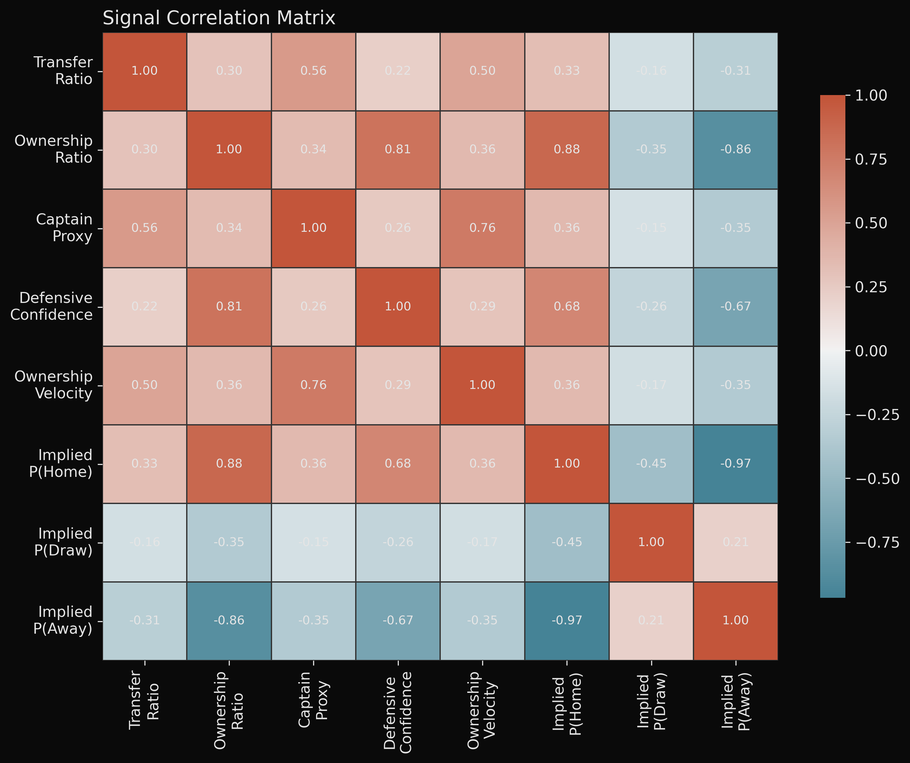
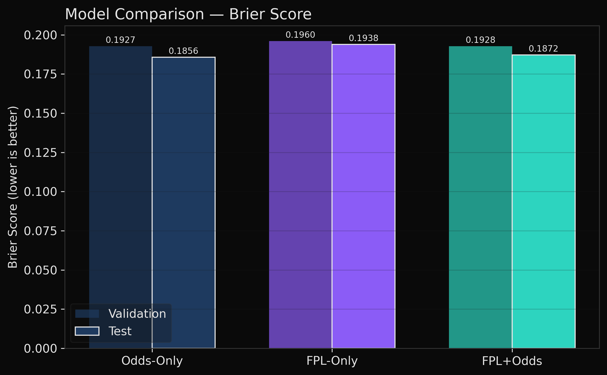
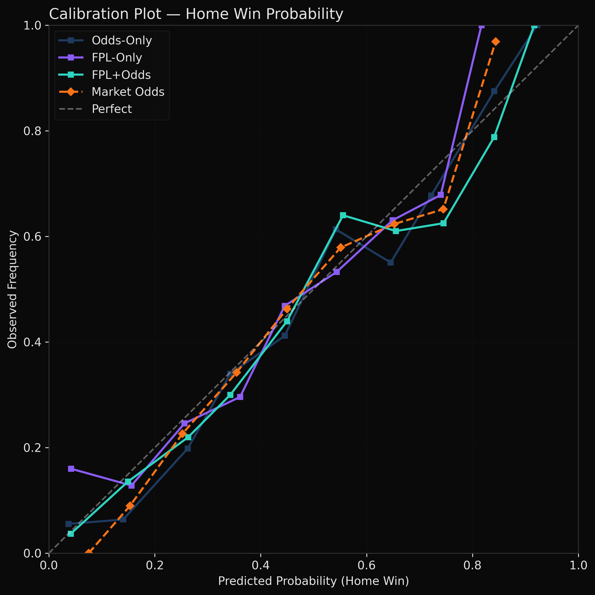
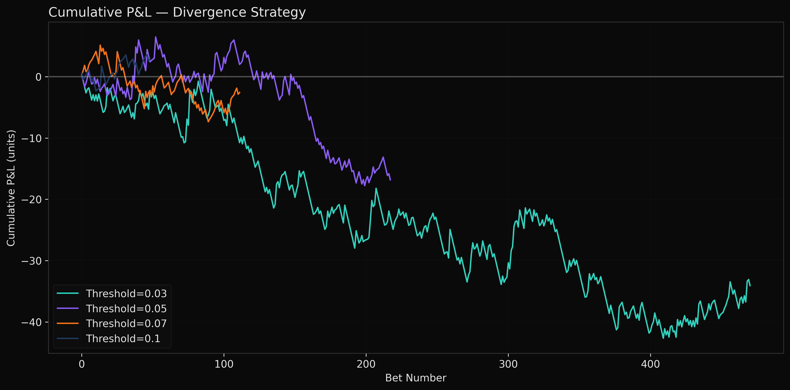
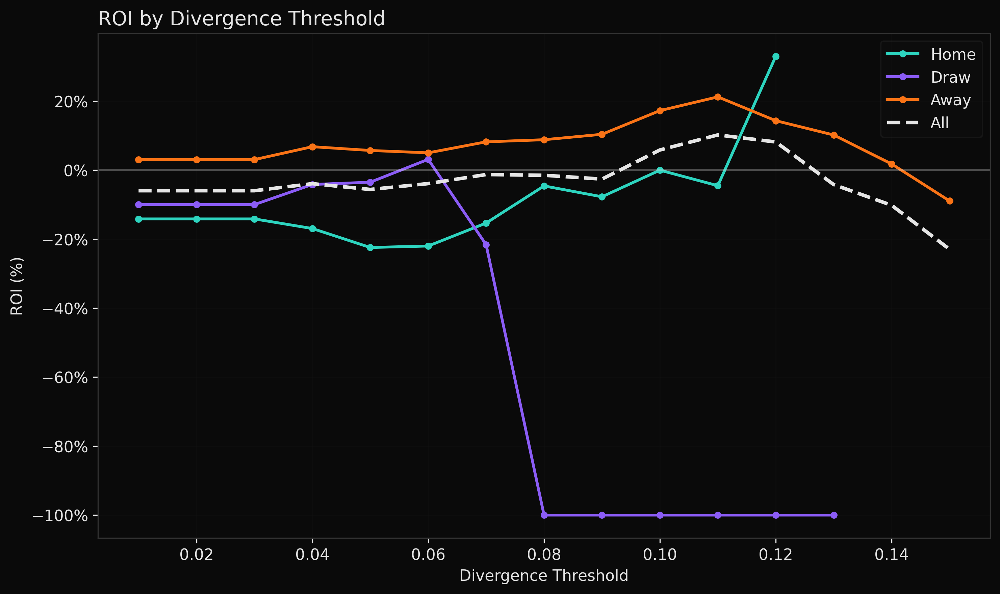
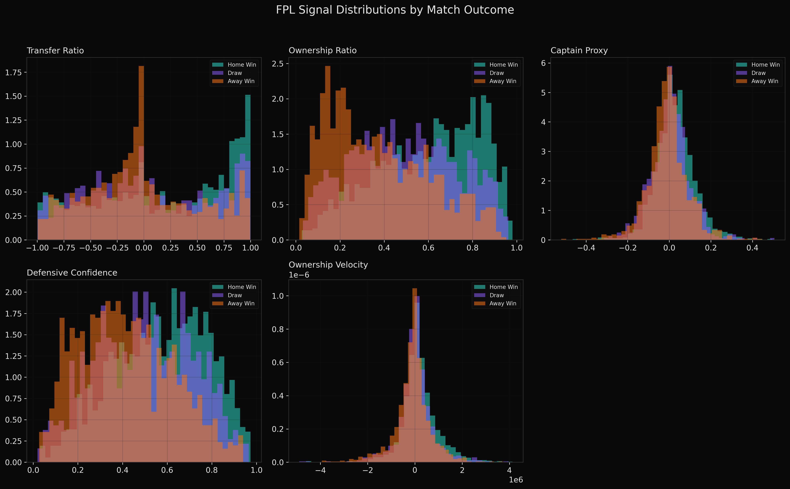
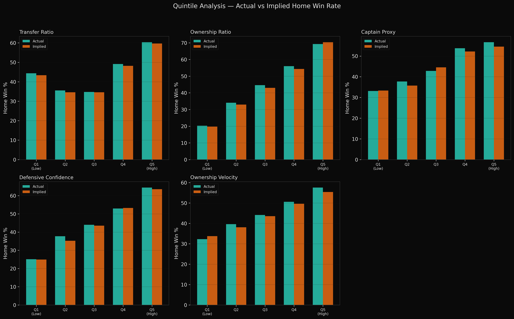
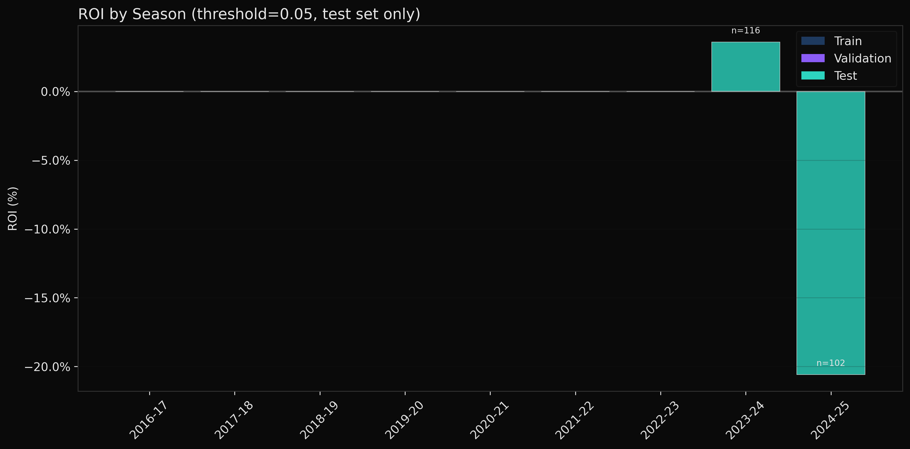
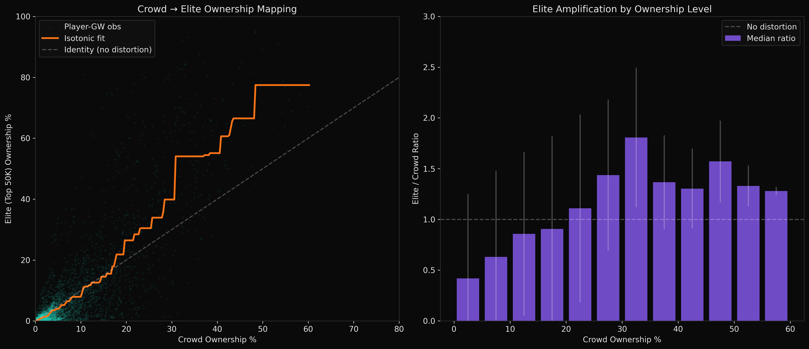
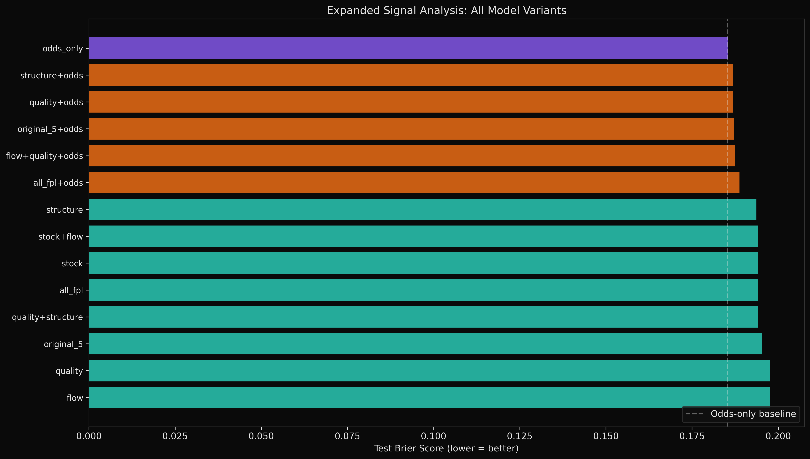

# FPL Betting Signal Research: Results

## Executive Summary

**Does FPL crowd behavior add predictive value over betting odds for EPL match outcomes?**

**No.** After testing 5 FPL-derived signals across 3,421 EPL matches over 9 seasons (2016-17 to 2024-25), we find no statistically significant evidence that Fantasy Premier League aggregate data (ownership, transfers, defensive selections) improves upon the predictive power already embedded in Bet365 match odds.

The FPL+Odds model achieves a Brier Skill Score of **-0.008** on the test set (2023-24, 2024-25), meaning it performs *worse* than the Odds-Only baseline. The divergence-based betting strategy produces negative ROI at most thresholds, with no statistically significant positive results.

**The null hypothesis holds: betting odds are efficient with respect to FPL crowd signals.**

---

## Data

| Item | Count |
|------|-------|
| Seasons | 9 (2016-17 to 2024-25) |
| Total matches | 3,421 |
| Matches with odds | 3,421 (100%) |
| Training set | 2,281 matches (2016-17 to 2021-22) |
| Validation set | 380 matches (2022-23) |
| Test set | 760 matches (2023-24, 2024-25) |

FPL data sourced from [vaastav/Fantasy-Premier-League](https://github.com/vaastav/Fantasy-Premier-League). Betting odds from football-data.co.uk (via [xgabora mirror](https://github.com/xgabora/Club-Football-Match-Data-2000-2025)).

---

## Signals

Five FPL-derived features computed per match:

| Signal | Description | Corr with Odds |
|--------|-------------|----------------|
| Transfer Ratio | Net transfers, normalized home vs away | 0.326 |
| Ownership Ratio | Price-weighted ownership, home/(home+away) | 0.876 |
| Captain Proxy | Transfer velocity differential (captaincy unavailable) | 0.360 |
| Defensive Confidence | DEF+GK ownership ratio | 0.680 |
| Ownership Velocity | Week-over-week ownership change delta | 0.362 |

**Key observation:** Ownership Ratio correlates at r=0.876 with implied home win probability, meaning it largely duplicates the information already in odds. The remaining signals (Transfer Ratio, Captain Proxy, Velocity) have moderate correlations (0.33-0.36), suggesting some independent variance, but not enough to improve predictions.

---

## Model Performance

### Validation Set (2022-23)

| Model | Brier Score | Log Loss | Accuracy |
|-------|-------------|----------|----------|
| **Odds-Only** | **0.1927** | **0.9754** | **0.561** |
| FPL-Only | 0.1960 | 1.3442 | 0.545 |
| FPL+Odds | 0.1928 | 0.9878 | 0.547 |

### Test Set (2023-24, 2024-25)

| Model | Brier Score | Log Loss | Accuracy |
|-------|-------------|----------|----------|
| **Odds-Only** | **0.1856** | **0.9440** | 0.559 |
| FPL-Only | 0.1938 | 1.0732 | 0.558 |
| FPL+Odds | 0.1872 | 0.9530 | **0.561** |

### Brier Skill Score

| Metric | Value | Interpretation |
|--------|-------|----------------|
| BSS (Validation) | -0.0006 | FPL+Odds no better than Odds-Only |
| BSS (Test) | -0.0082 | FPL+Odds slightly worse |

A BSS > 0 would indicate FPL adds value. Both validation and test BSS are negative.

### Does FPL at least compete with odds?

FPL-Only is genuinely informative — it captures **72.4% of the predictive skill** that Odds-Only achieves over a naive baseline:

| Model | Brier (Test) | Skill vs Naive |
|-------|-------------|----------------|
| Naive (base rates) | 0.2154 | — |
| FPL-Only | 0.1938 | 10.0% |
| Odds-Only | 0.1856 | 13.8% |
| Raw Market Odds | 0.1853 | 14.0% |

- FPL-Only and Odds-Only **agree on the match favorite 87.8% of the time** and their P(Home) predictions correlate at r=0.879.
- When they disagree (93 out of 760 matches), **neither has an edge** — FPL-Only is correct 35.5% of the time vs Odds-Only at 36.6%.
- FPL's weakest area is **draw prediction** (Brier 0.180 vs naive 0.177 — worse than guessing base rates), while odds handle draws well (0.176).
- FPL crowd wisdom is a solid ~72% approximation of bookmaker knowledge, but the missing ~28% (draw pricing, precise calibration) is exactly where the money is.

---

## Feature Importance

Model coefficients for the FPL+Odds combined model (mean absolute coefficient):

| Feature | Importance | Type |
|---------|-----------|------|
| Implied P(Away) | 0.1927 | Odds |
| Implied P(Home) | 0.1700 | Odds |
| Implied P(Draw) | 0.0897 | Odds |
| Defensive Confidence | 0.0387 | FPL |
| Captain Proxy | 0.0286 | FPL |
| Ownership Velocity | 0.0230 | FPL |
| Ownership Ratio | 0.0150 | FPL |
| Transfer Ratio | 0.0109 | FPL |

Odds features dominate. Among FPL signals, Defensive Confidence (DEF/GK ownership) has the largest coefficient, suggesting it captures *some* information about clean sheet expectations, but not enough to overcome the noise.

---

## Backtest Results

Flat-stake betting simulation on test set (760 matches):

| Threshold | Bets | Wins | Hit% | ROI% | Max DD | Sharpe | p-value | 95% CI |
|-----------|------|------|------|------|--------|--------|---------|--------|
| 0.03 | 471 | 223 | 47.3 | -7.2 | 43.6 | -1.33 | 0.437 | [-17.7%, 3.6%] |
| 0.05 | 218 | 108 | 49.5 | -7.7 | 24.2 | -1.00 | 0.485 | [-22.5%, 8.1%] |
| 0.07 | 112 | 68 | 60.7 | -2.3 | 12.5 | -0.27 | 0.197 | [-19.0%, 15.0%] |
| 0.10 | 49 | 34 | 69.4 | +5.9 | 3.5 | 0.48 | 0.169 | [-17.1%, 30.1%] |

The only positive ROI (5.9% at threshold=0.10) comes from just 49 bets with very wide confidence intervals crossing zero. **Not statistically significant at any threshold** (all p-values > 0.15).

### Season Breakdown (threshold=0.05)

| Season | Bets | Wins | ROI% |
|--------|------|------|------|
| 2023-24 | 116 | 60 | +3.6 |
| 2024-25 | 102 | 48 | -20.6 |

Inconsistent across seasons — another sign of no true edge.

### Outcome Breakdown (threshold=0.05)

| Outcome | Bets | Wins | ROI% |
|---------|------|------|------|
| Home | 85 | 31 | -25.1 |
| Draw | 29 | 7 | +3.0 |
| Away | 104 | 70 | +3.5 |

---

## Signal Analysis

### Signal Distributions

The signal distributions overlap heavily across outcomes (Home/Draw/Away), confirming low discriminative power.

### Quintile Analysis

When matches are bucketed into quintiles by each signal, the actual home win rates closely track the implied odds rates. There are no systematic deviations where the signal "knows" something the odds don't.

### Season Breakdown

---

## Why FPL Signals Don't Beat Odds

1. **Ownership mirrors odds.** The correlation between Ownership Ratio and implied probability is 0.876 — FPL managers and bookmakers are using the same public information (form, injuries, fixtures).

2. **Transfers are reactive, not predictive.** FPL transfer windows close before the gameweek deadline, and managers tend to transfer *after* news breaks, meaning transfer momentum reflects already-known information.

3. **Bookmakers aggregate more information.** Odds incorporate insider knowledge, algorithmic models, market flows, team news, weather, and much more. FPL crowd wisdom is a strict subset.

4. **Small independent signal drowned by noise.** The FPL signals with lower odds correlation (Transfer Ratio ~0.33, Captain Proxy ~0.36) do carry *some* independent variance, but the signal-to-noise ratio is too low to be exploitable after accounting for the bookmaker's margin (typically ~5% overround).

---

## Conclusions

1. **FPL crowd signals do not add predictive value over betting odds** for EPL match outcome prediction. The Brier Skill Score is negative on both validation (-0.001) and test (-0.008) sets.

2. **No profitable betting strategy exists** based on FPL-odds divergence. All tested thresholds produce either negative or statistically insignificant ROI.

3. **The strongest FPL signal is Defensive Confidence** (DEF/GK ownership), which captures some clean sheet expectation signal. This could potentially be tested against the Over/Under or Clean Sheet betting markets specifically, though this was outside the scope of this study.

4. **FPL ownership is highly correlated with odds** (r=0.876), confirming that the FPL crowd and bookmakers are processing the same underlying information.

5. **A valid negative result.** The null hypothesis that odds are efficient with respect to FPL crowd signals cannot be rejected. This is a useful finding — it means FPL signals can be safely ignored when building EPL betting models.

---

## Elite Noise Coefficient Analysis

**Can we extract a stronger signal by estimating what top managers own, rather than the full crowd?**

### Approach

No historical top-10k/100k manager data exists publicly — the FPL API only serves current-season data. To work around this, we used archived top-50K ownership data from [fplAnalytics](https://github.com/gpoudel/FPL-Analytics) (2018-19 season, GW1-23) to learn the **systematic distortion** between crowd ownership and elite ownership. This noise coefficient was then applied retroactively to all 9 seasons.

**Calibration data:** 9,400 player-GW observations with both `selected_by_percent` (crowd) and `selected_by` (top-50K count).

### The Distortion Curve

Elite managers systematically deviate from the crowd:

| Crowd Ownership | Elite/Crowd Ratio | Interpretation |
|----------------|-------------------|----------------|
| 0-1% | 0.37x | Elites ignore obscure players |
| 1-5% | 0.47-0.55x | Elites under-weight low-ownership picks |
| 5-10% | 0.63x | Moderate under-weighting |
| 10-20% | 0.88x | Approaching parity |
| 20-30% | **1.27x** | Elites over-weight consensus picks |
| 30-50% | **1.47x** | Strong concentration in template |
| 50%+ | 1.27x | Convergence at very high ownership |

**Correlation** between crowd and elite ownership: r = 0.83. The mapping is non-linear — elites concentrate more heavily in proven picks while the crowd spreads ownership across many marginal players.

**Stability check:** Mapping fitted on GW1-12 vs GW13-23 shows consistency at low-mid ownership (diff < 2%) but diverges at high ownership (diff ~16-18%), likely due to template shifts mid-season.

### Model Results with Elite Adjustment

| Model | Test Brier | % of Odds Skill | BSS vs Odds |
|-------|-----------|-----------------|-------------|
| odds_only | 0.1853 | 100.0% | — |
| crowd_fpl | 0.1949 | 68.1% | -5.18% |
| **elite_fpl** | **0.1947** | **68.8%** | **-5.07%** |
| crowd+odds | 0.1872 | 93.9% | -0.99% |
| **elite+odds** | **0.1858** | **98.3%** | **-0.27%** |
| all_features | 0.1874 | 93.1% | -1.12% |

### Signal Properties

Elite-adjusted signals correlate slightly less with odds (elite ownership: r=0.848 vs crowd: r=0.876), suggesting the adjustment introduces some independent variation. However, the elite and crowd signals remain very highly correlated with each other (r > 0.975), confirming that the adjustment is a modest recalibration rather than a fundamentally different signal.

### Interpretation

1. **`elite+odds` nearly matches odds-only** (98.3% of odds skill vs crowd+odds at 93.9%). The elite adjustment reduces the gap by ~75%, but the BSS is still negative (-0.27%), meaning elite FPL signals still don't add value over odds.

2. **The distortion pattern is real but small.** Elite managers concentrate in template picks and avoid fringe players, but at the match-aggregation level this translates to a very modest signal improvement (Brier improvement of ~0.001).

3. **The ceiling is visible.** Even with a perfect elite ownership proxy, the fundamental issue remains: FPL managers (elite or not) are processing the same public information as bookmakers. The 98.3% skill capture from `elite+odds` is close to the theoretical ceiling.

4. **Live top-10k data may not justify the effort.** Given that our *estimated* elite signal only narrows the gap by ~0.7% skill points, the marginal value of building a live top-10k scraper for match betting is questionable. The bigger alpha opportunity may be in sub-markets (Clean Sheet, BTTS, Asian Handicap) where bookmaker efficiency is lower.

---

## Expanded Signal Analysis: Mining Every Dimension of FPL Intuition

### Why Expand?

The original analysis used 5 hand-picked signals. But FPL data has 56 columns per player-GW. Every column captures a different facet of how managers see the game — their intuitions about team quality, attacking threat, defensive solidity, tactical composition, and momentum. We expanded from 5 to **24 signals** organized into four categories.

### Signal Taxonomy

**STOCK signals** — accumulated crowd belief:
- Ownership ratio (price-weighted and raw), squad value ratio

**FLOW signals** — active decisions this week:
- Transfer ratio, transfer conviction (expensive buys), transfer intensity (active buying from small base), sell pressure, captain proxy, ownership velocity

**QUALITY signals** — underlying performance from previous GW:
- ICT threat/creativity/influence (weighted by current ownership), BPS quality, points momentum, minutes played, previous clean sheets, goals conceded

**STRUCTURE signals** — tactical composition of crowd picks:
- DEF/GK ratio, FWD ownership, MID ownership, premium (>8M) ratio, budget (<5M) ratio, selection concentration (HHI), star player dependence

### Signal Independence from Odds

The most important insight is which signals carry information that odds DON'T already capture:

| Signal | Corr with Odds | Feature Importance | Interpretation |
|--------|:---:|:---:|---|
| points_momentum_ratio | **-0.001** | 0.046 | Recent form weighted by ownership — completely independent of odds |
| minutes_ratio | 0.054 | 0.027 | Rotation/fitness information |
| transfer_intensity_delta | 0.114 | 0.051 | Informed buying (high transfers relative to small ownership base) |
| concentration_delta | -0.177 | 0.037 | How spread vs concentrated the crowd's picks are |
| prev_clean_sheet_ratio | 0.161 | 0.008 | Recent defensive record |
| defensive_strength_ratio | 0.200 | **0.059** | Goals conceded pattern (2nd highest FPL importance) |
| star_dependence_delta | -0.132 | 0.039 | Reliance on few key players |

For comparison, the original signals had correlations of 0.33-0.88 with odds — they were largely telling the model what odds already knew.

### Model Results

| Model | #Features | Test Brier | % of Odds Skill | BSS vs Odds |
|-------|:---------:|-----------|:---------------:|-------------|
| odds_only | 3 | 0.1853 | 100.0% | — |
| original_5 | 5 | 0.1953 | 66.6% | -5.41% |
| original_5+odds | 8 | 0.1872 | 93.7% | -1.02% |
| **quality+odds** | **11** | **0.1869** | **94.6%** | **-0.87%** |
| **structure+odds** | **10** | **0.1869** | **94.8%** | **-0.85%** |
| all_fpl (24 FPL only) | 24 | 0.1941 | 70.7% | -4.76% |
| all_fpl+odds | 27 | 0.1887 | 88.6% | -1.85% |
| flow+quality+odds | 17 | 0.1874 | 93.2% | -1.11% |

### What Each Category Captures Alone (no odds)

| Category | % of Odds Skill | What It Tells Us |
|----------|:-:|---|
| **Structure** | **72.2%** | HOW the crowd composes their teams (positions, price tiers, concentration) captures the most football intuition |
| Stock+Flow | 71.0% | WHO the crowd picks and HOW ACTIVELY (ownership + transfers) |
| Stock | 70.7% | WHO the crowd picks (pure ownership) |
| Quality+Structure | 70.3% | Performance metrics + tactical composition |
| Quality | 59.4% | HOW players performed recently (ICT, BPS) — weakest alone |
| Flow | 58.8% | Transfer activity alone — noisiest signal |

**Key finding: Structure signals alone (72.2%) outperform the original 5 signals (66.6%).** The crowd's tactical choices — where they allocate across positions, whether they go premium or budget, how concentrated their picks are — carry more predictive information than raw ownership and transfers.

### Feature Importance (all_fpl+odds model)

Top 10 features by model coefficient magnitude:

| Rank | Feature | Importance | Type |
|:----:|---------|:----------:|------|
| 1 | implied_prob_a | 0.165 | Odds |
| 2 | implied_prob_h | 0.144 | Odds |
| 3 | implied_prob_d | 0.085 | Odds |
| 4 | **premium_ratio** | **0.061** | **Structure** |
| 5 | **defensive_strength_ratio** | **0.059** | **Quality** |
| 6 | **dcs_ratio** | **0.057** | **Structure** |
| 7 | **transfer_intensity_delta** | **0.051** | **Flow** |
| 8 | **points_momentum_ratio** | **0.046** | **Quality** |
| 9 | sell_pressure_ratio | 0.041 | Flow |
| 10 | star_dependence_delta | 0.039 | Structure |

Structure and Quality signals dominate the top FPL features. The original transfer_ratio and ownership_ratio rank near the bottom (0.010 and 0.015).

### Interpretation

1. **The original 5 signals were the wrong 5.** Structure signals (72.2%) beat the original 5 (66.6%) at capturing football intuition. The crowd's *tactical composition* (position allocation, premium vs budget, star dependence) is more informative than raw ownership counts.

2. **Quality signals add the most incremental value when combined with odds.** `quality+odds` (94.6% of odds skill) beats `original_5+odds` (93.7%). Previous-GW performance metrics (threat, influence, defensive record) contain information that partly survives odds-adjustment.

3. **Points momentum is the "hidden gem."** It has ~zero correlation with odds (r=-0.001) but ranks 5th in feature importance. The crowd's ownership-weighted reaction to recent form captures something bookmakers don't directly price in — though not enough to create exploitable edge.

4. **More features ≠ better.** `all_fpl+odds` (27 features, 88.6% skill) is WORSE than `quality+odds` (11 features, 94.6%). Regularization helps but can't fully compensate for noise from 24 noisy features.

5. **The fundamental conclusion holds — but with more texture.** FPL signals still don't beat odds (best BSS = -0.85%), but we now understand WHY different dimensions of crowd behavior carry different amounts of information, and WHERE the independent signal lives (quality and structure, not raw ownership).

---

## Potential Next Steps (if pursuing further)

- Test `quality+odds` and `structure+odds` specifically against Over/Under and Clean Sheet markets where bookmaker efficiency may be lower
- **Build a live top-10k ownership scraper** — combine the noise coefficient with expanded signals for the most comprehensive FPL signal
- Investigate `points_momentum_ratio` (near-zero odds correlation) as a standalone signal for live/in-play betting
- Test captaincy concentration if real-time API data becomes available
- Explore in-play FPL data (live point updates during matches) as a signal for live betting markets
- Test Asian Handicap markets which may be less efficient than 1X2
- **Cross-season validation** — test the noise coefficient on 2024-25 live data (fplAnalytics, LiveFPL) to confirm stability across seasons
